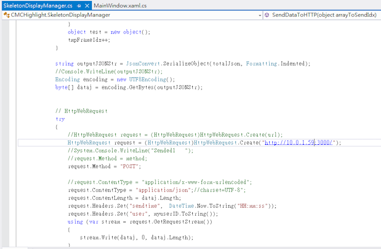

# README #

This README would normally document whatever steps are necessary to get your application up and running.

## What Is This Repository For?

* (some introduction)
* Version 1.0


## Architecture
There are three parts in this project :

* **Kinect Capture Tool**
	- Visual Studio Project
	- Written with C#
	- Captures Skeleton data via Kinect v1 at 30fps and stores it in text format
	
* **Server Controller**
	- Node.js project
	- Can start/stop and set timer to stop Kinect remotely

* **Python Analyzer Tool**
	- Not implemented yet

## Requirements
- [Node.js](https://nodejs.org/en/)
- [Visual Studio 2012](https://www.visualstudio.com) or higher
- Kinect for Windows (First generation)
- [Kinect for Windows SDK v1.8](https://www.microsoft.com/en-us/download/details.aspx?id=40278)
- [Kinect for Windows Developer Toolkit v1.8](https://www.microsoft.com/en-us/download/details.aspx?id=40276)

## How To Get Started


### Part 1. Node.js Server Setup
- ```./Server/app.js``` : server code
- ```./Server/res/``` : some CSS and JavaScript files associated with styles of the web application
- ```./Server/index.html``` : controller webpage

- ```npm install``` : install all modules listed as dependencies in```./package.json```
- ```npm start``` : starts app.js (the server) and start HTTP server (IPv4) on port 3000


- You should set up your **client 1 and client 2 IP addresses** (Connect to Kinect) in the code (red box), and can change your server port (orange box)

### Part 2. Kinect project Setup
- Remember to install Kinect for Windows SDK and Developer Toolkit first
- ```./KinectTapingToolkit/KinectTapingToolkit/MainWindow.xaml.cs``` handles main window which shows Kinect-captured video
- ```./KinectTapingToolkit/KinectTapingToolkit/ChooseKinectWin.xaml.cs``` handles small prompt appearing at start which lets you set Group and User of the log data name (for organization)
- ```./KinectTapingToolkit/KinectTapingToolkit/SkeletonDisplayManager.cs``` Captures user's skeleton, transforms it into X,Y,Z coordinates and JSON format then stores it in text file (```./KinectTapingToolkit/KinectTapingToolkit/Logs/```) and sends it by HTTP POST to Server once per second. (The system can also be configured to POST more than once per second, if desired. Not recommended for slow connections)


*You can change the log data storing path and file name in the code*



*Also, remember to change the server IP so you can control the Kinect remotely*


- ```./KinectTapingToolkit/KinectTapingToolkit/ColorStreamManager.cs``` Transforms RGB video captured by Kinect and renders it in main window


####Run it


#####*Just start the project right away*


#####*Due to permissions w.r.t. writing logs to file, you must run the program as an administrator*


#####*At beginning of the program, you can set the group and user ID*


#####*The Example log data and server state info shown in main window*

## Files

- [Version 1.0 on Google Drive](https://drive.google.com/open?id=0B85ZG5LLKQI9V3VaMFRXOGFZUzQ)
- [Bitbucket Repository](https://bitbucket.org/garynil1635/kinect-taping-toolkit/) - If there is any update, I will put it here first.
 
## Credits
- KinChat Toolkit is owned and maintained by [NTHU CSCLab](http://csclab.tw).
- Please feel free to contact [Gary Lin](mailto:gary19930520@gmail.com) if you have some advice or need any further information.

## License
* Check [LICENSE.txt](./LICENSE.txt) for this project
